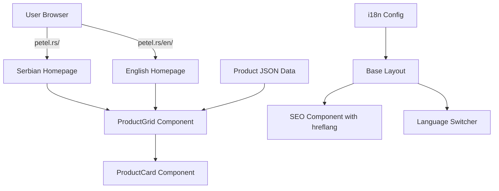

# Petel E-commerce Technical Blueprint

## Architecture Overview



## Technology Stack Recommendations

### Core Technologies

- **Framework**: Astro.js 4.x (SSG-first with Islands architecture)
- **Language**: TypeScript (strict mode)
- **Package Manager**: PNPM
- **Rendering Strategy**: **Static Site Generation (SSG)** - Best for SEO and performance
- **Deployment**: **Vercel or Cloudflare Pages** - Excellent for static sites with edge capabilities

### Why SSG for E-commerce?

- Pre-rendered pages = fastest load times = best SEO
- All product pages indexed at build time
- Can rebuild on product data changes
- Perfect for catalog-based e-commerce without real-time inventory

### Recommended Libraries

- `astro-i18next` or `astro-i18n` for internationalization
- `@astrojs/sitemap` for SEO sitemap generation
- `fuse.js` for client-side product search
- `nanostores` for lightweight state management (filters, search)

## Folder Structure

```
petel-website/
├── src/
│   ├── components/
│   │   ├── products/
│   │   │   ├── ProductCard.astro
│   │   │   ├── ProductGrid.astro
│   │   │   ├── ProductFilter.astro
│   │   │   └── ProductSearch.astro
│   │   ├── layout/
│   │   │   ├── Header.astro
│   │   │   ├── Footer.astro
│   │   │   └── LanguageSwitcher.astro
│   │   └── seo/
│   │       ├── SEOHead.astro
│   │       └── JsonLD.astro
│   ├── layouts/
│   │   ├── BaseLayout.astro
│   │   └── ProductLayout.astro
│   ├── pages/
│   │   ├── index.astro              # Serbian homepage (default)
│   │   ├── proizvodi/
│   │   │   ├── index.astro          # Serbian products page
│   │   │   └── [slug].astro         # Serbian product detail
│   │   ├── kontakt.astro            # Serbian contact
│   │   └── en/
│   │       ├── index.astro          # English homepage
│   │       ├── products/
│   │       │   ├── index.astro      # English products page
│   │       │   └── [slug].astro     # English product detail
│   │       └── contact.astro        # English contact
│   ├── data/
│   │   ├── products.json            # Bilingual product data
│   │   └── categories.json          # Bilingual category data
│   ├── i18n/
│   │   ├── config.ts                # i18n configuration
│   │   ├── utils.ts                 # i18n helper functions
│   │   ├── sr.json                  # Serbian translations
│   │   └── en.json                  # English translations
│   ├── types/
│   │   ├── product.ts               # Product type definitions
│   │   └── i18n.ts                  # i18n type definitions
│   ├── utils/
│   │   ├── seo.ts                   # SEO helper functions
│   │   ├── products.ts              # Product data utilities
│   │   └── url.ts                   # URL/slug generation
│   └── styles/
│       ├── global.css
│       └── variables.css
├── public/
│   ├── images/
│   │   └── products/
│   ├── robots.txt
│   └── favicon.ico
├── astro.config.mjs
├── tsconfig.json
├── package.json
└── pnpm-lock.yaml
```

## Data Structure

### Product Type Definition (`src/types/product.ts`)

```typescript
export interface Product {
  id: string;
  slug_sr: string;
  slug_en: string;
  sku: string;
  category: string;
  name_sr: string;
  name_en: string;
  description_sr: string;
  description_en: string;
  short_description_sr?: string;
  short_description_en?: string;
  price: number;
  currency: 'RSD' | 'EUR';
  images: ProductImage[];
  specifications: ProductSpecification[];
  inStock: boolean;
  featured?: boolean;
  keywords_sr: string[];
  keywords_en: string[];
  meta_description_sr?: string;
  meta_description_en?: string;
}

export interface ProductImage {
  url: string;
  alt_sr: string;
  alt_en: string;
  isPrimary: boolean;
}

export interface ProductSpecification {
  key_sr: string;
  key_en: string;
  value_sr: string;
  value_en: string;
}
```

### Example Product Data (`src/data/products.json`)

```json
[
  {
    "id": "prod-001",
    "slug_sr": "led-sijalica-e27-10w",
    "slug_en": "led-bulb-e27-10w",
    "sku": "LED-E27-10W",
    "category": "led-lighting",
    "name_sr": "LED Sijalica E27 10W",
    "name_en": "LED Bulb E27 10W",
    "description_sr": "Energetski efikasna LED sijalica...",
    "description_en": "Energy-efficient LED bulb...",
    "short_description_sr": "10W LED sijalica sa E27 grlom",
    "short_description_en": "10W LED bulb with E27 socket",
    "price": 450,
    "currency": "RSD",
    "images": [
      {
        "url": "/images/products/led-e27-10w-1.jpg",
        "alt_sr": "LED sijalica E27 10W",
        "alt_en": "LED bulb E27 10W",
        "isPrimary": true
      }
    ],
    "specifications": [
      {
        "key_sr": "Snaga",
        "key_en": "Power",
        "value_sr": "10W",
        "value_en": "10W"
      }
    ],
    "inStock": true,
    "featured": true,
    "keywords_sr": ["led", "sijalica", "energetska efikasnost", "e27"],
    "keywords_en": ["led", "bulb", "energy efficient", "e27"],
    "meta_description_sr": "Kupite LED sijalicu E27 10W - energetski efikasno osvetljenje za vaš dom",
    "meta_description_en": "Buy LED Bulb E27 10W - energy-efficient lighting for your home"
  }
]
```

## i18n Configuration

### i18n Config (`src/i18n/config.ts`)

```typescript
export const languages = {
  sr: 'Srpski',
  en: 'English'
};

export const defaultLang = 'sr';

export const ui = {
  sr: {
    'nav.home': 'Početna',
    'nav.products': 'Proizvodi',
    'nav.contact': 'Kontakt',
    'product.price': 'Cena',
    'product.inStock': 'Na stanju',
    'product.outOfStock': 'Nema na stanju',
    'search.placeholder': 'Pretražite proizvode...',
    'filter.category': 'Kategorija',
    'filter.apply': 'Primeni filter'
  },
  en: {
    'nav.home': 'Home',
    'nav.products': 'Products',
    'nav.contact': 'Contact',
    'product.price': 'Price',
    'product.inStock': 'In Stock',
    'product.outOfStock': 'Out of Stock',
    'search.placeholder': 'Search products...',
    'filter.category': 'Category',
    'filter.apply': 'Apply Filter'
  }
} as const;

export function getLangFromUrl(url: URL) {
  const [, lang] = url.pathname.split('/');
  if (lang in languages) return lang as keyof typeof languages;
  return defaultLang;
}

export function useTranslations(lang: keyof typeof languages) {
  return function t(key: keyof typeof ui[typeof defaultLang]) {
    return ui[lang][key] || ui[defaultLang][key];
  }
}
```

### URL Helper Utils (`src/utils/url.ts`)

```typescript
export function getLocalizedUrl(path: string, locale: string): string {
  if (locale === 'sr') return path;
  return `/en${path}`;
}

export function getAlternateUrl(currentUrl: string, targetLocale: string): string {
  const path = currentUrl.replace(/^\/en/, '');
  return getLocalizedUrl(path, targetLocale);
}
```

## Component Architecture

### SEO Head Component (`src/components/seo/SEOHead.astro`)

**Key Features:**

- Automatic hreflang tag generation
- Open Graph and Twitter Card meta tags
- JSON-LD structured data for products
- Canonical URL management
- Serbian-first meta tags
```typescript
interface Props {
  title: string;
  description: string;
  keywords?: string[];
  image?: string;
  locale: 'sr' | 'en';
  alternateUrls: { locale: string; url: string }[];
  canonicalUrl: string;
  jsonLD?: Record<string, any>;
}
```


### Product Card Component (`src/components/products/ProductCard.astro`)

**Features:**

- Displays product image, name, price
- Language-aware content rendering
- Lazy loading images
- Microdata/JSON-LD markup
- Link to localized product detail page
```typescript
interface Props {
  product: Product;
  locale: 'sr' | 'en';
}
```


### Product Grid Component (`src/components/products/ProductGrid.astro`)

**Features:**

- Responsive CSS Grid layout
- Client-side filtering (Astro Island with React/Preact/Svelte)
- Search integration
- Pagination support
```typescript
interface Props {
  products: Product[];
  locale: 'sr' | 'en';
  showFilters?: boolean;
  showSearch?: boolean;
}
```


### Language Switcher Component (`src/components/layout/LanguageSwitcher.astro`)

**Features:**

- Preserves current page context (e.g., `/proizvodi/led-sijalica` → `/en/products/led-bulb`)
- Uses `<link rel="alternate">` for SEO
- Accessible (ARIA labels, keyboard navigation)
- Displays current language with flag/icon
```typescript
interface Props {
  currentLocale: 'sr' | 'en';
  currentPath: string;
}
```


## Routing Strategy

### URL Structure

| Locale | Homepage | Products List | Product Detail | Contact |

|--------|----------|---------------|----------------|---------|

| Serbian (default) | `/` | `/proizvodi` | `/proizvodi/led-sijalica-e27-10w` | `/kontakt` |

| English | `/en/` | `/en/products` | `/en/products/led-bulb-e27-10w` | `/en/contact` |

### Dynamic Page Generation (`src/pages/proizvodi/[slug].astro`)

```typescript
export async function getStaticPaths() {
  const products = await import('../../data/products.json');
  
  return products.default.map((product) => ({
    params: { slug: product.slug_sr },
    props: { product, locale: 'sr' }
  }));
}
```

### English Dynamic Pages (`src/pages/en/products/[slug].astro`)

```typescript
export async function getStaticPaths() {
  const products = await import('../../../data/products.json');
  
  return products.default.map((product) => ({
    params: { slug: product.slug_en },
    props: { product, locale: 'en' }
  }));
}
```

## SEO Implementation

### hreflang Tags (in `SEOHead.astro`)

```html
<link rel="canonical" href={canonicalUrl} />
<link rel="alternate" hreflang="sr" href={serbianUrl} />
<link rel="alternate" hreflang="en" href={englishUrl} />
<link rel="alternate" hreflang="x-default" href={serbianUrl} />
```

### Sitemap Configuration (`astro.config.mjs`)

```javascript
export default defineConfig({
  site: 'https://petel.rs',
  integrations: [
    sitemap({
      i18n: {
        defaultLocale: 'sr',
        locales: {
          sr: 'sr-RS',
          en: 'en-US',
        },
      },
    }),
  ],
});
```

### robots.txt (`public/robots.txt`)

```
User-agent: *
Allow: /
Sitemap: https://petel.rs/sitemap-index.xml
```

## Search & Filter Implementation

### Client-Side Search with Fuse.js

```typescript
// src/components/products/ProductSearch.tsx (React Island)
import Fuse from 'fuse.js';
import { useState, useMemo } from 'react';

const fuseOptions = {
  keys: ['name_sr', 'name_en', 'description_sr', 'description_en', 'keywords_sr', 'keywords_en'],
  threshold: 0.3,
};

export function ProductSearch({ products, locale }) {
  const [query, setQuery] = useState('');
  const fuse = useMemo(() => new Fuse(products, fuseOptions), [products]);
  
  const results = query ? fuse.search(query).map(r => r.item) : products;
  
  return (/* Search UI with filtered results */);
}
```

### Filter Component with Nanostores

```typescript
// src/stores/filterStore.ts
import { atom, computed } from 'nanostores';

export const selectedCategory = atom<string | null>(null);
export const priceRange = atom<[number, number]>([0, 10000]);

export const filteredProducts = computed(
  [selectedCategory, priceRange],
  (category, [min, max]) => {
    // Filter logic
  }
);
```

## Configuration Files

### Astro Config (`astro.config.mjs`)

```javascript
import { defineConfig } from 'astro/config';
import sitemap from '@astrojs/sitemap';

export default defineConfig({
  site: 'https://petel.rs',
  trailingSlash: 'never',
  build: {
    format: 'directory',
  },
  integrations: [
    sitemap({
      i18n: {
        defaultLocale: 'sr',
        locales: {
          sr: 'sr-RS',
          en: 'en-US',
        },
      },
    }),
  ],
  vite: {
    ssr: {
      noExternal: ['fuse.js'],
    },
  },
});
```

### TypeScript Config (`tsconfig.json`)

```json
{
  "extends": "astro/tsconfigs/strict",
  "compilerOptions": {
    "baseUrl": ".",
    "paths": {
      "@components/*": ["src/components/*"],
      "@layouts/*": ["src/layouts/*"],
      "@utils/*": ["src/utils/*"],
      "@data/*": ["src/data/*"],
      "@types/*": ["src/types/*"],
      "@i18n/*": ["src/i18n/*"]
    }
  }
}
```

### Package.json Scripts

```json
{
  "scripts": {
    "dev": "astro dev",
    "build": "astro build",
    "preview": "astro preview",
    "lint": "eslint . --ext .ts,.astro",
    "type-check": "astro check"
  }
}
```

## Performance Optimizations

1. **Image Optimization**: Use Astro's `<Image>` component with automatic WebP conversion
2. **CSS**: Critical CSS inlined, rest deferred
3. **JavaScript**: Islands architecture loads JS only for interactive components
4. **Lazy Loading**: Product images load on scroll
5. **Build-time**: Products pre-rendered at build for instant loading

## Deployment Recommendations

### Option 1: Vercel (Recommended)

- Zero-config Astro support
- Automatic preview deployments
- Edge network for fast global delivery
- Easy environment variables for API keys

### Option 2: Cloudflare Pages

- Excellent for Serbian users (edge locations)
- Free tier very generous
- CDN built-in

## Next Steps

1. Initialize project with `pnpm create astro@latest`
2. Install dependencies: `pnpm add fuse.js nanostores`
3. Set up folder structure as outlined
4. Create type definitions for products
5. Implement base layout with SEO component
6. Build ProductCard and ProductGrid components
7. Create static pages for each locale
8. Implement dynamic product pages
9. Add search and filter functionality
10. Test hreflang implementation
11. Generate and submit sitemap
12. Deploy to Vercel/Cloudflare Pages

## Key Serbian SEO Considerations

- Serbian language in `<html lang="sr">` attribute
- Serbian keywords in meta tags first
- Cyrillic support (if needed, expand data structure)
- Local business schema for Serbian address
- Serbian currency (RSD) as default
- Local payment methods integration ready